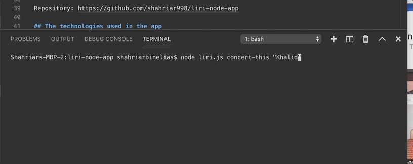
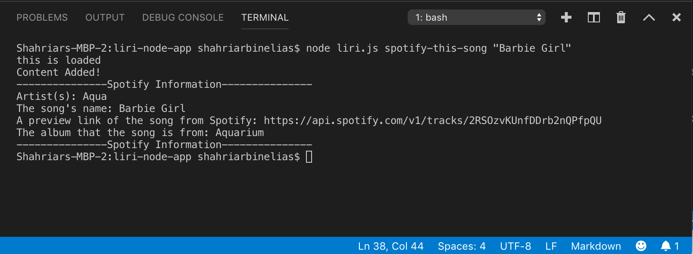

# liri-node-app

## Problem the app is trying to solve
LIRI is like iPhone's SIRI. However, while SIRI is a Speech Interpretation and Recognition Interface, LIRI is a _Language_ Interpretation and Recognition Interface. LIRI will be a command line node app that takes in parameters and gives you back data.

## How the app is organized?

LIRI will search Spotify for songs, Bands in Town for concerts, and OMDB for movies.

## Give a high-level overview of how the app is organized
liri.js - Have all the logic which is required to function the app properly 
package.json - Consist of all the dependencies require to run the app
package-lock.json - is automatically generated for any operations where npm modifies either the node_modules tree, or package.json
random.txt - contains LIRI's commands for `node liri.js "do-what-it-says"` instruction 
README.md - contains valuable information about the app
package.json - file is the heart of Node.js system 
log.txt - contains all the commands that were ran
.env - files to ignore uploading in github

## Instructions on how to run the app

### Commands to use the APP

   * `node liri.js concert-this "artist name"`
   
   

   * `node liri.js spotify-this-song`

   
   

   * `node liri.js spotify-this-song "song name"`

   
   

   * `node liri.js movie-this "movie name"`

   
   

   * `node liri.js do-what-it-says`

   
   
  
   * `node liri.js do-what-t-says`
    

    
    

    * `node liri.js do-what-` error command provides suggestion

    
    

## Link to a deployed version of the app

App homepage: https://shahriar998.github.io/liri-node-app/.

Repository: https://github.com/shahriar998/liri-node-app

## The technologies used in the app
1. Javascript
2. Nodejs
3. Node packages:
4. Node-Spotify-API
5. Request
6. Moment
7. DotEnv
8. APIs used:
    a. Bands in Town
    b. OMDB
9. GitHub

## My role in the app development

My role was both developer and a tester in order do trial and run every step of appliction during the build 

#### Licensing

The code in this project is licensed under Shahriar Bin Elias 

